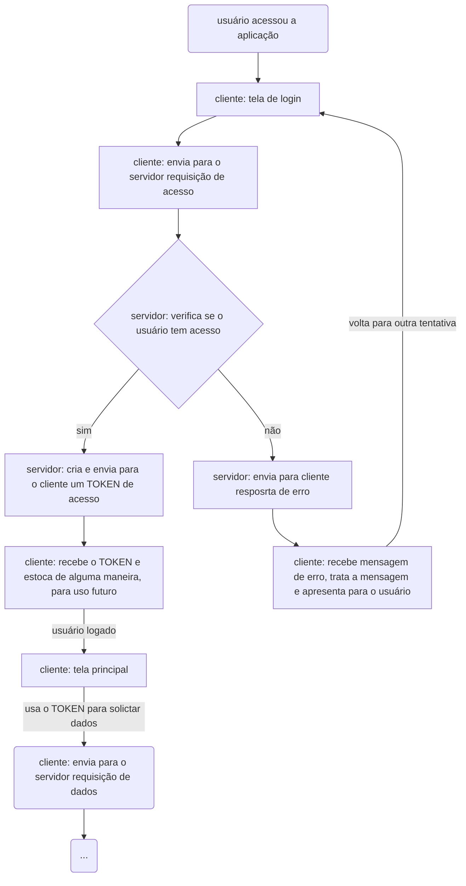

# 2024-FASE6-BSI2022

Ao baixar (somente na primeira vez):
1. git clone https://github.com/ifcvarela/2024-bsi22-fase6....web-dev2....pessoa-rest-api
2. no terminal digitar: npm install

Para rodar o servidor:
1. no terminal digitar: npm run dev

# Atividade 2

Utilizand como base a aplição feita em sala de aula, faça:

1. Criar uma tela de login com usuário e senha, utilizando as rotas do servidor previamente criadas.

2. Adicionar o campo senha (e verificar senha) nos cadastros de usuários.

3. Criar regra de negócios onde somente seja possível alterar e excluir dados do usuário logado. Os usuários logados podem cadastrar novos usuários mas não podem alterar ou excluir dados de outros usuários.

